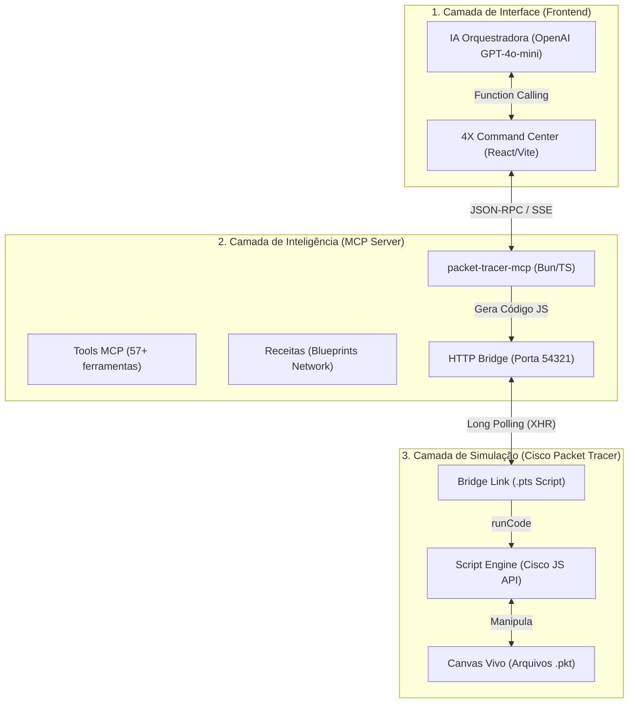

# 🌐 Arquitetura 4X NET AGENT

O **4X NET AGENT** é um ecossistema de orquestração inteligente para o **Cisco Packet Tracer 9.0**. Ele permite que engenheiros de rede e estudantes criem, configurem e auditem topologias complexas usando linguagem natural, receitas declarativas ou comandos em lote, eliminando a necessidade de cliques manuais repetitivos.

## 🏗️ Visão Geral do Sistema

A arquitetura é dividida em três camadas principais interligadas em tempo real:

---

## 🚀 1. Camada de Interface (Frontend)
Localizada no diretório `pt-command-center`.

*   **Tecnologia:** Vite + React + TypeScript.
*   **Design (CiscoFastXpert):** Estética industrial de alta fidelidade, modo escuro, foco em densidade de dados e visualização de topologia.
*   **Orquestração de IA:** Utiliza o modelo `gpt-4o-mini` da OpenAI para interpretar pedidos como *"Crie uma rede com 2 roteadores e um switch no meio"*.
    *   A IA mapeia o texto para chamadas de função (`Function Calling`) que o Dashboard traduz em requisições para o Servidor MCP.

---

## 🧠 2. Camada de Inteligência (MCP Server)
Localizada no diretório `packet-tracer-mcp-new`.

O servidor utiliza o **Model Context Protocol (MCP)**, um padrão aberto para conectar IAs a ferramentas locais.
*   **Repositório Oficial:** [Jcorderop02/packet-tracer-mcp](https://github.com/Jcorderop02/packet-tracer-mcp)

*   **Filosofia "Canvas-First":** O servidor não guarda uma cópia da rede em memória. Toda vez que você pede algo, ele faz um "Snapshot" do que está aberto no Packet Tracer. A rede real é a única fonte de verdade.
*   **Recursos Principais:**
    *   **Recipes (Receitas):** Blueprints declarativos (ex: `campus_vlan`, `edge_nat`) que aplicam configurações complexas de forma idempotente (se você rodar duas vezes, ele só aplica o que falta).
    *   **Snapshots & Diffing:** Capacidade de salvar o estado atual da rede e comparar com estados anteriores para detectar mudanças ou erros.
    *   **Tools (Ferramentas):** Mais de 50 funções granulares como `pt_add_device`, `pt_create_link`, `pt_run_cli`, etc.

---

## 🌉 3. Camada de Conexão (The Bridge)
Como o Packet Tracer não tem uma API de rede nativa, o projeto utiliza uma técnica de "Bridge" (Ponte):

1.  **Script PTS:** Um script de automação (`mcp-bridge.pts`) é carregado dentro do Packet Tracer.
2.  **Webview Polling:** Este script abre uma janela oculta que faz requisições HTTP para o servidor local a cada 500ms.
3.  **Execução de Código:** O servidor envia blocos de código JavaScript puro que o Packet Tracer executa internamente para criar cabos, mover dispositivos ou configurar o terminal (CLI).

---

## 🛠️ Recursos Utilizados

| Recurso | Utilidade | Funcionalidade |
| :--- | :--- | :--- |
| **Bun Runtime** | Backend do MCP | Execução ultra-rápida de TypeScript e servidor HTTP embutido. |
| **OpenAI API** | Cérebro do App | Tradução de "Intenção Humana" em "Ações de Rede". |
| **Mermaid.js** | Visualização | Renderização dinâmica do mapa da topologia no dashboard. |
| **Script Engine PT** | API Nativa Cisco | Acesso aos objetos internos do simulador (Roteadores, Portas, Cabos). |
| **cliclick (macOS)** | Automação de UI | Usado para tarefas que a API da Cisco não cobre (cliques em diálogos de UI). |

---

## 🤖 Integração com Agente Antigravity

Além do Dashboard gráfico, o **Antigravity** (este agente que você está operando) possui integração profunda com o ecossistema através do protocolo MCP.

*   **Controle via Terminal:** O agente Antigravity pode executar as mesmas ferramentas do servidor MCP diretamente através de comandos de terminal ou chamadas de função internas.
*   **Orquestração Híbrida:** Você pode pedir ao Antigravity para *"analisar o arquivo de configuração atual e corrigir as rotas OSPF"* e ele usará o MCP para ler o Packet Tracer, processar a lógica e enviar os comandos de correção.
*   **Acesso Direto:** Como o servidor MCP está rodando localmente, o Antigravity atua como um "braço robótico" adicional, permitindo que você gerencie a rede sem precisar abrir o navegador, usando apenas prompts no chat/terminal.

---

## 💡 Utilidade e Valor do App

O **4X NET AGENT** resolve o maior gargalo do Packet Tracer: **o tempo gasto em tarefas repetitivas.**

1.  **Montagem Instantânea:** O que levaria 30 minutos clicando e arrastando (cabos, IPs, VLANs) é feito em 30 segundos via comando de voz ou texto.
2.  **Auditoria Automatizada:** O app consegue ler toda a topologia e avisar se há erros de configuração, como IPs em subredes erradas ou portas desligadas.
3.  **Aprendizado Acelerado:** Permite focar na lógica de rede e protocolos, enquanto a IA cuida da "escovação de bits" e sintaxe de comandos CLI.
